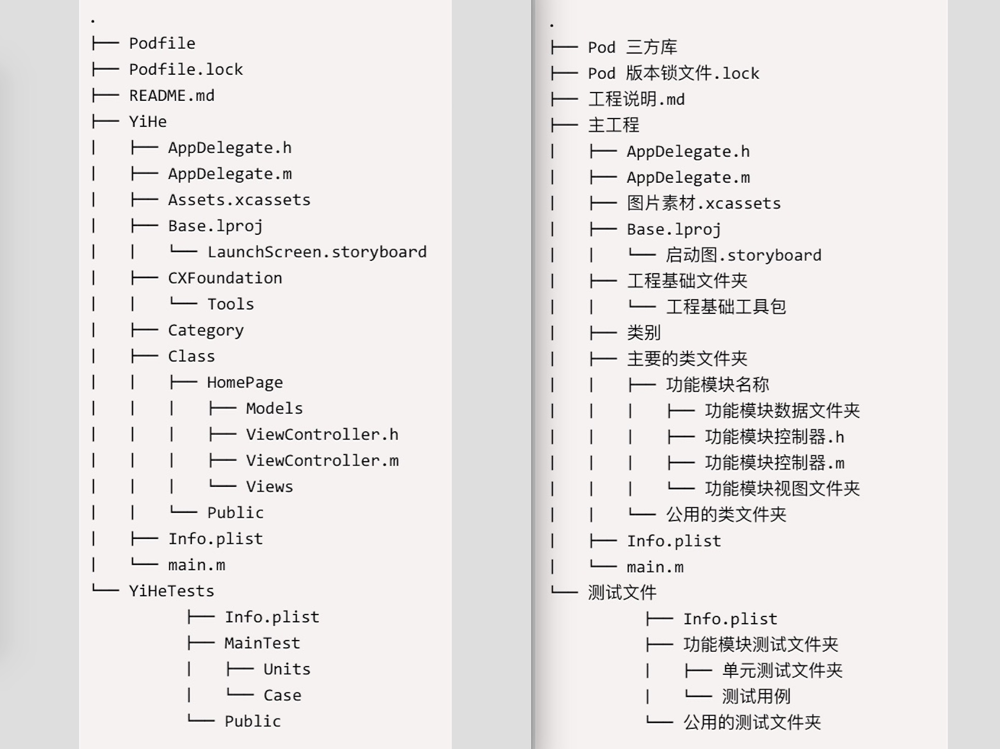

# 智艺创想移动端开发代码风格指南

本指南用于简要描述智艺创想约定的移动端代码编写指南.

`iOS`基于 [Apple’s Cocoa Coding Guidelines](https://developer.apple.com) 和 [raywenderlich.com](http://www.raywenderlich.com) 编写.暂时不包含 C++ 和 C 语言相关代码规范.

`Android`参考[Google Java Style Guide](https://google.github.io/styleguide/javaguide.html)和官方[Android Code Style for Contributors](https://source.android.com/source/code-style.html) 编码风格规范.

## 概述

编写该指南的目的是为了保持我们开发过程中代码风格一致,更利于不同的开发人员阅读和维护代码.

该指南设定的目的和很多决定都是为了减少屏幕占用空间,易于阅读以及增加代码的自解释性等出发点考虑的.

该指南目前还在修订版本中,会不定期更新维护,以最新发布版本为准.

## 作者

该指南由[lipyoung](https://github.com/LipYoung)编写.

[smelloftime](https://github.com/smelloftime)和[Jungle68](https://github.com/Jungle68)共同修订.

特别感谢 [raywenderlich.com](http://www.raywenderlich.com).

## 补充

针对`iOS`开发者以下是苹果官方文档编码指南.如果对于本编码规范有任何不全面或者争议的部分,可以在 Xcode 的官方文档中搜索 ` Coding Guidelines for Cocoa` 进行查阅.

或者你也可以查阅以下在线文档:

* [The Objective-C Programming Language](http://developer.apple.com/library/mac/#documentation/Cocoa/Conceptual/ObjectiveC/Introduction/introObjectiveC.html)
* [Cocoa Fundamentals Guide](https://developer.apple.com/library/mac/#documentation/Cocoa/Conceptual/CocoaFundamentals/Introduction/Introduction.html)
* [Coding Guidelines for Cocoa](https://developer.apple.com/library/mac/#documentation/Cocoa/Conceptual/CodingGuidelines/CodingGuidelines.html)
* [iOS App Programming Guide](http://developer.apple.com/library/ios/#documentation/iphone/conceptual/iphoneosprogrammingguide/Introduction/Introduction.html)

针对`Android`开发者,基本的格式方面使用`AndroidStudio`默认模板即可（使用格式化快捷键`(ctrl+alt+L/commond+alt+L)`、`Eclipes(ctrl+shift+F)`处理.

## 执行

本指南所有规范分为`必须严格执行该规范`使用关键字`<span style="color:#FF0000">required</span>`标注.`应该使用该规范`使用关键字`<span style="color:#008000">optional</span>`标注.

行政处罚标准

| 规范类型 | 单条规范</br>违反次数 | 处罚金额 | 补充说明 |
|:----:|----:|----:|:----:|
| <span style="color:#FF0000">required</span> | 1 - 2次 | 5元人民币 | 连续多天违反同一条规范,处罚金额在前一天的基础上增量叠加 |
| <span style="color:#FF0000">required</span> | 3 -5次 | 10元人民币 | 连续多天违反同一条规范,处罚金额在前一天的基础上增量叠加 |
| <span style="color:#FF0000">required</span> | 5次以上 | 15元人民币 | 连续多天违反同一条规范,处罚金额在前一天的基础上增量叠加 |
|  |  |  |  |
| <span style="color:#008000">optional</span> | 1 - 2次 | 邮件警告 |  |
| <span style="color:#008000">optional</span> | 3 -5次 | 5元人民币 | 连续多天违反同一条规范,处罚金额在前一天的基础上增量叠加 |
| <span style="color:#008000">optional</span> | 5次以上 | 10元人民币 | 连续多天违反同一条规范,处罚金额在前一天的基础上增量叠加 |

**注意:**

所有行政处罚邮件,统一提交行政和财务,月底工资结清时扣除.扣除资金作为公司开发人员活动经费.(当单日罚款金额超过 80后,超出部分不计入扣款)

`连续多天违反同一条规范,触发金额在前一天的基础上增量叠加`指的是:

10月1号因为违反了编号 1的规范罚款 10元后.10月2号又因违反了编号 1的规范处罚 10元的情况时.10月2号因为编号 1的规范导致的实际的罚款金额为 20元.

## 目录

* [语言](#语言)
* [缩写](#缩写)
* [代码分组](#代码分组)
* [代码区块注释](#代码区块注释)
	* [头文件注释](##头文件注释)
	* [头文件引用注释](##头文件引用注释)
	* [说明注释](#说明注释)
* [空格与换行](#空格与换行)
* [日志](#日志)
* [命名](#命名)
	* [常量](##常量)
	* [变量](##变量)
	* [属性](##属性)
	* [数字](##数字)
* [方法](#方法)
* [属性特征](#属性特征)
* [点语法](#点语法)
* [字面值](#字面值)
* [枚举](#枚举)
* [case](#case)
* [布尔值](#布尔值)
* [条件语句](#条件语句)
* [CGRect](#CGRect)
* [工程](#工程)
* [OOP](#OOP)
* [commits](#commits)

## 语言

##### 规范编号: 1 <span style="color:#FF0000">required</span>

必须使用英语进行编码,不允许使用中文或者拼音!

注释可以使用中文.

## 缩写

##### 规范编号: 2.1 <span style="color:#FF0000">required</span>

当使用缩写时,**必须**使用网络上能轻易查询到的缩写,或者使用工程名类前缀.

##### 规范编号: 2.2 <span style="color:#008000">optional</span>

除非使用统一达成共识的缩写.如果使用统一的缩写必须注明在工程的 `README.md` 文件下.

```shell
## 统一缩写表

ViewControl -> VC
```

## 代码分组

##### 规范编号: 3 <span style="color:#FF0000">required</span>

类实现时,必须对类结构分组

`iOS`开发者使用 `// MARK: - ` 来对代码进行分组.遵循以下结构:

```objc
// MARK: - Lifecycle
- (instancetype)init {}
- (void)dealloc {}
- (void)viewDidLoad {}
- (void)viewWillAppear:(BOOL)animated {}
- (void)didReceiveMemoryWarning {}

// MARK: - Custom Accessors
- (void)setCustomProperty:(id)value {}
- (id)customProperty {}

// MARK: - IBActions
- (IBAction)submitData:(id)sender {}

// MARK: - Public
- (void)publicMethod {}

// MARK: - Private
- (void)privateMethod {}

// MARK: - Protocol conformance
// MARK: - UITextFieldDelegate
// MARK: - UITableViewDataSource
// MARK: - UITableViewDelegate
// MARK: - NSNotification

// MARK: - NSCopying
- (id)copyWithZone:(NSZone *)zone {}

// MARK: - NSObject
- (NSString *)description {}
```

`iOS`开发者编写文件的公开部分(.h)遵循以下结构:

```objc
@interface MyClass : NSObject <
	Delegate
>

@property(nonatomic,assign) id obj;

- (void)method;

+ (void)classMethod;
```

`Android`开发者遵循以下结构:

```java
/**
 * @author zhiyi-hehuajun
 * @describe 金币展示和兑换页
 * @date 2016/8/28
 * @contact emial:335891510@qq.com
 */
public class GoldActivity extends BaseActivity implements GoldView {
	// 常量
    public static final String GOLD_ACTIVITY_UPDATE_GOLD = "gold_activity_update_gold";

    // UI 控件区
    @Nullable
    @BindView(R.id.tv_gold_amount)
    TextView mTvGoldAmount;

    // 变量区
    @Inject
    GoldPresenter mPresenter;

    // 生命周期方法
    @Override
    protected void onCreate(Bundle savedInstanceState) {
        super.onCreate(savedInstanceState);
    }

    // 重载方法
    @Override
    private void testChange() {
    }

    // 自定义方法
    private void initDialog() {
    }

    // 内部类
    public class OnPopTabListener implements View.OnClickListener {
    }
}

```

## 代码区块注释

##### 规范编号: 4.1 <span style="color:#FF0000">required</span> #DC143C

`iOS`开发者没有特殊说明,**不准**随意使用 `#warning`以及`#pragma message` 和 `#error`!以及

##### 规范编号: 4.2 <span style="color:#008000">optional</span>

`iOS`开发者编写注释时使用最新的Xcode 8支持的注释.按照不同的情况分为以下几种

``` objc
区分主代码段落
// MARK: - 

区分次要代码段落
// MARK:

提示修复内容
// FIXME: 

未完成功能
// TODO:
```

### 头文件注释

##### 规范编号: 4.2.1 <span style="color:#008000">optional</span>

在开发过程中,需要对头文件(安卓称为接口文件)编写必要的注释.

##### 规范编号: 4.2.2 <span style="color:#FF0000">required</span>

控制器类和视图类文件公开部分(.h)代码的头文件需要标注注释该类的作用,而文件私有部分(.m)可以不添加详细的注释.

如果类特别复杂,才需要添加详细的设计思路.

### 头文件引用注释

##### 规范编号: 4.3 <span style="color:#008000">optional</span>

`ios`开发者类实现文件(.m)中引用的其他文件应该使用 `// MARK: `进行划分.默认首先放控制器(Controller),然后依次是视图(View)和模型(Model)工具类(Tools)和三方库等.

**例如:**

```objc
// MARK: Controller
#import "ViewController.h"
// MARK: View
#import "TestTableViewCell.h"
// MARK: Model
#import "ViewModel.h"
// MARK: Tools
#import "ViewTools.h"
// MARK: Tripartite Library
#import <AFNetworking/AFNetworking.h>

```

`Android`开发者引用头文件时,必须格式化排版引用头文件排序的位置.

### 说明注释

##### 规范编号: 4.4 <span style="color:#FF0000">required</span>

当需要注释时,注释应该用来解释这段特殊代码为什么要这样做.任何被使用的注释都必须保持最新或被删除,不允许保留无效的注释.

##### 规范编号: 4.4.1 <span style="color:#008000">optional</span>

公开接口必须拥有详细的注释.对接口作出充分的说明.

一般都避免对私有方法注释,因为代码尽可能做到自解释.

应该避免对每段代码进行注释,只有端出现断断续续的几行代码时才需要注释.

##### 规范编号: 4.5 <span style="color:#FF0000">required</span>

开发过程中,任何代码都应该保证是被使用中,未使用的代码应该被删除.

当某些特殊情况需要长期注释掉某段代码时.必须增加一行详细注释理由和时间.

长期注释统一格式是 `// [注释说明] 注释理由 时间`.

**例如:**

```objc
// [长期注释] 注释理由是为了演示给大家看. 2016.11.23
// [Code user];

```

##### 规范编号: 4.7 <span style="color:#FF0000">required</span>

`iOS`开发时,方法注释,属性注释等都必须将注释写在上一行,这样可以兼容 `Xcode` 的注释规则,方便调用方法时编辑器可以同步显示注释信息.

## 空格与换行

##### 规范编号: 5 <span style="color:#FF0000">required</span>

* 缩进使用 4 个空格
* 数学运算符左右使用空格进行分隔.
* 方法调用传入参数时,统一在后一个参数前增加一个空格进行分隔.
* 方法大括号和其他大括号(`if/else/switch/while` 等.)总是在同一行语句打开但在新行中关闭,即使只有一条语句(或是空)，也应该把大括号写上.

**最佳:**

```objc
if (user.isHappy) {
  //Do something
} else {
  //Do something else
}
```

**不建议:**

```objc
if (user.isHappy)
{
    //Do something
}
else {
    //Do something else
}
```

##### 规范编号: 5.1 <span style="color:#FF0000">required</span>

在方法之间应该有且只有一行,这样有利于在视觉上更清晰和更易于组织.在方法内的空白部分应该且只以一行换行分离功能,但通常都抽离出来成为一个新方法.

##### 规范编号: 5.2 <span style="color:#FF0000">required</span>

`iOS`开发时:
* 优先使用 auto-synthesis 但如果有必要 @synthesize 和 @dynamic应该在实现中每个都声明新的一行
* 应该避免以冒号对齐的方式来调用方法,虽然有时方法签名可能有3个以上的冒号和冒号对齐会使代码更加易读,但是 Xcode 的对齐方式令代码块难以辨认,所以**不允许**这样做.

**最佳:**

```objc
// blocks are easily readable
[UIView animateWithDuration:1.0 animations:^{
  // something
} completion:^(BOOL finished) {
  // something
}];
```

**不建议:**

```objc
// colon-aligning makes the block indentation hard to read
[UIView animateWithDuration:1.0
                 animations:^{
                     // something
                 }
                 completion:^(BOOL finished) {
                     // something
                 }];
```

## 日志

##### 规范编号: 6 <span style="color:#FF0000">required</span>

`iOS`开发时当需要使用日志输出时(`NSLog(...)`),必须使用统一自定义的日志输出(`ZYLog(...)`),**不允许**直接使用官方的日志输出.因为官方的日志输出信息少,输出格式自由,不方便统一查询问题.

##### 规范编号: 6.1 <span style="color:#008000">optional</span>

应该尽量减少使用日志输出,同时**不应该**将其他人分支使用不到的日志输出代码提交到公用的分支上.导致控制台日志信息阅读不便.

开发过程其他类似于日志输出这样仅仅作为临时使用的代码,都**不允许**提交到公用的分支上.

## 命名

##### 规范编号: 7 <span style="color:#008000">optional</span>

编写尽量长的,描述清晰的方法和变量名是最好的做法.

### 常量

常量是容易重复被使用和无需通过查找和代替就能快速修改值.

##### 规范编号: 7.1 <span style="color:#FF0000">required</span>

`iOS`开发时常量应该使用驼峰式命名规则,所有的单词首字母大写和加上与类名有关的前缀.

四个字符的前缀 `ZYCX` 是可以被使用的.并且应该用在类和常量命名时.也可以考虑使用项目名称缩写作为类前缀.

**最佳:**

```objc
static NSTimeInterval const ZYCXTutorialViewControllerNavigationFadeAnimationDuration = 0.3;
```

**不建议:**

```objc
static NSTimeInterval const fadetime = 1.7;
```

##### 规范编号: 7.1.2

`Android`开发时,常量名命名模式为CONSTANT_CASE,全部字母大写,用下划线分隔单词.这些名字通常是名词或名词短语,第一个词表明作用.并以组的形式给予注释如：

```java
//支付方式，0代表支付宝，1代表微信
public static final int PAY_TYPE_ALIPAY = 0;
public static final int PAY_TYPE_WX = 1;

//数据列表，默认开始页
public static final int DEFALT_PAGE_NO = 1;
```

##### 规范编号: 7.1.1 <span style="color:#FF0000">required</span>

`iOS`开发时.常量应该使用 `static` 来声明而不是使用 `#define`.

**最佳:**

```objc
static NSString * const ZYCXAboutViewControllerCompanyName = @"RayWenderlich.com";

static CGFloat const ZYCXImageThumbnailHeight = 50.0;
```

**不建议:**

```objc
#define CompanyName @"RayWenderlich.com"

#define thumbnailHeight 2
```

### 变量

##### 规范编号: 7.2 <span style="color:#008000">optional</span>

变量命名时应该尽量具有描述性.除了在 `for()` 循环内,尽量避免单个字母命名.

##### 规范编号: 7.3 <span style="color:#008000">optional</span>

变量命名以`LowerCamelCase`风格

`Android`变量命名基本结构为 `scopeVariableNameType`

`scope`分为以下几种:

1. 局部变量不添加`scope`
2. 非公有，非静态变量以`m`开头,
3. 公有非静态字段命名以`p`开头
4. 静态字段命名以`s`开头
5. 公有静态字段（全局变量）命名以`g`开头

`iOS`变量命名基本结构为 `scopeVariableNameType`

`scope`分为以下几种:

1. 方法内的变量和属性不添加`scope`.
2. 方法外的局部静态变量(非公有)的以`k`开头.
3. 公开的静态字段(全局变量)以类前缀开头.

### 属性

##### 规范编号: 7.4 <span style="color:#FF0000">required</span>

属性也是使用驼峰式,但首单词的首字母小写,对属性使用 auto-synthesis 而不是手动编写 @synthesize 语句,除非有足够的理由.

**最佳:**

```objc
@property (strong, nonatomic) NSString *descriptiveVariableName;
```

**不建议:**

```objc
@interface Class : NSObject{
	NSString *property;
}
```

##### 规范编号: 7.4.1 <span style="color:#FF0000">required</span>

`iOS`开发者开发时,星号表示变量是指针.正常情况下: `NSString *text` 正确,而不是使用 `NSString* text` 或者使用 `NSString * text`.

通过使用`back`属性(`_variable`,变量名前面有下划线)直接访问实例变量应该尽量避免,除了在初始化方法(init, initWithCoder:, 等…),dealloc 方法和自定义的setters和getters.

**最佳:**

```objc
@interface ZYCXTutorial : NSObject

@property (strong, nonatomic) NSString *tutorialName;

@end
```

**不建议:**

```objc
@interface ZYCXTutorial : NSObject {
  NSString *tutorialName;
}
```

##### 规范编号: 7.4.2 <span style="color:#FF0000">required</span>

`iOS`开发时所有属性特性应该显式地列出来,有助于阅读代码.属性特性的顺序应该是storage、atomicity,与在Interface Builder连接UI元素时自动生成代码一致.

**最佳:**

```objc
@property (weak, nonatomic) IBOutlet UIView *containerView;
@property (strong, nonatomic) NSString *tutorialName;
```

**不建议:**

```objc
@property (nonatomic, weak) IBOutlet UIView *containerView;
@property (nonatomic) NSString *tutorialName;
```

##### 规范编号: 7.4.3 <span style="color:#008000">optional</span>

NSString等拥有可变子类的类应该使用copy 而不是 strong的属性特性.
为什么？即使你声明一个NSString的属性,有人可能传入一个NSMutableString的实例,然后在你没有注意的情况下修改它.

**最佳:**

```objc
@property (copy, nonatomic) NSString *tutorialName;
```

**不建议:**

```objc
@property (strong, nonatomic) NSString *tutorialName;
```


### 下划线

##### 规范编号: 7.5 <span style="color:#FF0000">required</span>

`iOS`开发者使用属性时,实例变量应该使用 `self.` 来访问和改变.这就意味着所有属性将会视觉效果相同,因为它们前面都有 `self.`.

但有一个特例:在初始化方法里,实例变量(例如,`_variableName`)应该直接被使用来避免 `getters/setters` 潜在的副作用.

局部变量不应该包含下划线.

##### 规范编号: 7.5.1 <span style="color:#FF0000">required</span>

图片资源文件和音频资源文件统一使用下划线命名法.

`Android`开发者编写布局文件(.xml)时,也统一使用下划线命名法.

### 数字

##### 规范编号: 7.6 <span style="color:#FF0000">required</span>

当使用数字时,应尽量避免直接使用数字,而使用常量/变量对数字进行一定的描述.

在实际开发中,应该让设计师设计`UI`效果图时必须给定一套通用的UI间隔规范.

**最佳:**

```objc
static const int cellCount = 3;
static const int cellWidth = 30;
static const int screenWidth = 360;

CGFloat cellHeight = screenWidth - cellCount * cellWidth;
```

```java
    private static final  int DEFAULT_BOX_COUNT = 30;
    private static final  int DEFAULT_BOX_WITH = 100;
    private static final  int DEFAULT_BOX_HEIGHT = 100;

    private int mBoxWith = DEFAULT_BOX_WITH;  

    private int mBoxHeight = DEFAULT_BOX_HEIGHT;

    private int mBoxLenght = 2 * (mBoxWith + mBoxHeight);
```

**不建议:**

```objc
int a = 360 - 3 * 30;
```

## 方法

##### 规范编号: 8

`iOS`开发者在方法签名中,应该在方法类型(`-/+` 符号)之后有一个空格.在方法各个段落之间以及运算符号前后应该也有一个空格(符合Apple的风格).在参数之前应该包含一个具有描述性的关键字来描述参数.

`and`这个词的用法应该保留,尽量不要使用.它不应该用于多个参数来说明,就像 `initWithWidth:height` 以下这个例子：

**最佳:**
```objc
- (void)setExampleText:(NSString *)text image:(UIImage *)image;
- (void)sendAction:(SEL)aSelector to:(id)anObject forAllCells:(BOOL)flag;
- (id)viewWithTag:(NSInteger)tag;
- (instancetype)initWithWidth:(CGFloat)width height:(CGFloat)height;
```

**不建议:**

```objc
-(void)setT:(NSString *)text i:(UIImage *)image;
- (void)sendAction:(SEL)aSelector :(id)anObject :(BOOL)flag;
- (id)taggedView:(NSInteger)tag;
- (instancetype)initWithWidth:(CGFloat)width andHeight:(CGFloat)height;
- (instancetype)initWith:(int)width and:(int)height;  // 决定允许这样写!
- (instancetype)init:(int)width :(int)height;  // 决定允许这样写!
```

## 点语法

##### 规范编号: 9 <span style="color:#FF0000">required</span>

`iOS`开发时,点语法是一种很方便封装访问方法调用的方式.当你使用点语法时,通过使用getter或setter方法,属性仍然被访问或修改.

为了代码的统一和简洁,在修改和访问属性时,除非有充值的理由否则**必须**使用点语法.`[]`符号更偏向于用在其他地方

**最佳:**
```objc
NSInteger arrayCount = [self.array count];
view.backgroundColor = [UIColor orangeColor];
[UIApplication sharedApplication].delegate;
```

**不建议:**
```objc
NSInteger arrayCount = self.array.count;
[view setBackgroundColor:[UIColor orangeColor]];
UIApplication.sharedApplication.delegate;
```

## 字面值

##### 规范编号: 10 <span style="color:#FF0000">required</span>

NSString, NSDictionary, NSArray, 和 NSNumber的字面值应该在创建这些类的不可变实例时被使用.

**最佳:**

```objc
NSArray *names = @[@"Brian", @"Matt", @"Chris", @"Alex", @"Steve", @"Paul"];
NSDictionary *productManagers = @{@"iPhone": @"Kate", @"iPad": @"Kamal", @"Mobile Web": @"Bill"};
NSNumber *shouldUseLiterals = @YES;
NSNumber *buildingStreetNumber = @10018;
```

**不建议:**

```objc
NSArray *names = [NSArray arrayWithObjects:@"Brian", @"Matt", @"Chris", @"Alex", @"Steve", @"Paul", nil];
NSDictionary *productManagers = [NSDictionary dictionaryWithObjectsAndKeys: @"Kate", @"iPhone", @"Kamal", @"iPad", @"Bill", @"Mobile Web", nil];
NSNumber *shouldUseLiterals = [NSNumber numberWithBool:YES];
NSNumber *buildingStreetNumber = [NSNumber numberWithInteger:10018];
```

## 枚举

##### 规范编号: 11 <span style="color:#FF0000">required</span>

`iOS`开发时当使用enum时,使用新的固定基本类型规格,因为它有更强的类型检查和代码补全.现在 SDK 有一个宏 `NS_ENUM()` 来帮助和鼓励你使用固定的基本类型

**例如:**

```objc
typedef NS_ENUM(NSInteger, ZYCXLeftMenuTopItemType) {
  ZYCXLeftMenuTopItemMain, ///< 这是一条注释
  ZYCXLeftMenuTopItemShows,
  ZYCXLeftMenuTopItemSchedule
};
```

你也可以显式地赋值.

```objc
typedef NS_ENUM(NSInteger, ZYCXGlobalConstants) {
  ZYCXPinSizeMin = 1,
  ZYCXPinSizeMax = 5,
  ZYCXPinCountMin = 100,
  ZYCXPinCountMax = 500,
};
```

##### 规范编号: 11.1.1 <span style="color:#FF0000">required</span>

`iOS`开发时除非编写使用 C语言编写 `Core Foundation` 相关框架.否则避免使用旧的枚举方式.

**不建议:**

```objc
enum GlobalConstants {
  kMaxPinSize = 5,
  kMaxPinCount = 500,
};
```


## Case

##### 规范编号: 12 <span style="color:#FF0000">required</span>

在编写 Case 语句时,除非含有多行代码,否则不建议加上括号.

```objc
switch (condition) {
  case 1:
    // ...
    break;
  case 2: {
    // ...
    // Multi-line example using braces
    break;
  }
  case 3:
    // ...
    break;
  default: 
    // ...
    break;
}

```

当相同的代码被多个 cases 使用时,需要使用下穿式语法(fall-through).下穿式语法指的是在 case 最后一处 `break`语句,这样就允许执行流程跳转执行下一个 case 的值.为了代码更佳清晰,一个下穿式语法需要注释

```objc
switch (condition) {
  case 1:
    // 下穿执行 **  fall-through! **
  case 2:
    // code executed for values 1 and 2
    break;
  default: 
    // ...
    break;
}

```

当在switch使用枚举类型时,`default`可以删除.

```objc
ZYCXLeftMenuTopItemType menuType = ZYCXLeftMenuTopItemMain;

switch (menuType) {
  case ZYCXLeftMenuTopItemMain:
    // ...
    break;
  case ZYCXLeftMenuTopItemShows:
    // ...
    break;
  case ZYCXLeftMenuTopItemSchedule:
    // ...
    break;
}
```

## 布尔值

##### 规范编号: 13 <span style="color:#FF0000">required</span>

`iOS`开发者编写`Objective-C`必须使用 `YES` 和 `NO`.因为 `true` 和 `false` 应该只在 `CoreFoundation`,C 或 C++ 代码使用.

既然nil解析成NO,所以没有必要在条件语句比较.也不要拿某样东西直接与YES比较,因为YES被定义为 1 但一个 BOOL 有可能被设置为 8 bits .所以为了在阅读不同文件时,视觉上一致.

**最佳:**

```objc
if (someObject) {}
if (![anotherObject boolValue]) {}
```

**不建议:**

```objc
if (someObject == nil) {}
if ([anotherObject boolValue] == NO) {}
if (isAwesome == YES) {} // Never do this.
if (isAwesome == true) {} // Never do this.
```

设置 `BOOL` 属性是,需要参考一贯的 `get` 访问器名称.例如:

```objc
@property (assign, getter=isEditable) BOOL editable;
```

`Android`开发者在使用变量和布尔值进行比较时,必须隐试的进行比较.

**最佳:**

```java
if (someObject) {}
if (!someObject) {}
```

**不建议:**

```java
if (isAwesome == true) {} // Never do this.
if (isAwesome != true) {} // Never do this.
```

## 条件语句

##### 规范编号: 14 <span style="color:#FF0000">required</span>

条件语句**必须**使用大括号圆,哪怕有的时候不需要大括号(如只编写一行代码的条件语句时).

**最佳:**
```objc
if (!error) {
  return success;
}
```

**不建议:**
```objc
if (!error)
  return success;
```

或者

```objc
if (!error) return success;
```

### 三目运算符

##### 规范编号: 15 <span style="color:#008000">optional</span>

当需要提高代码的清晰性和简洁性时,三目运算符`? :`才会使用.单个条件求值时,也可以考虑使用它.

多个条件求值时,如果使用`if` 条件语句或重构成实例变量时,代码会更加易读时,就避免编写过于复杂和冗余的三目运算语句.为了可读性,也**不允许**编写嵌套的三木运算语句.

一般来说,最好使用三目运算符是在根据条件来赋值时.

**最佳:**
```objc
NSInteger value = 5;
result = (value != 0) ? x : y;

BOOL isHorizontal = YES;
result = isHorizontal ? x : y;
```

**不建议:**
```objc
result = a > b ? x = c > d ? c : d : y;
```

## CGRect

##### 规范编号: 16 <span style="color:#FF0000">required</span>

`iOS`开发时当访问 CGRect 里的 `x, y, width, height` 时,应该使用CGGeometry函数而不是直接通过结构体来访问.

**最佳:**

```objc
CGRect frame = self.view.frame;

CGFloat x = CGRectGetMinX(frame);
CGFloat y = CGRectGetMinY(frame);
CGFloat width = CGRectGetWidth(frame);
CGFloat height = CGRectGetHeight(frame);
CGRect frame = CGRectMake(0.0, 0.0, width, height);
```

**不建议:**

```objc
CGRect frame = self.view.frame;

CGFloat x = frame.origin.x;
CGFloat y = frame.origin.y;
CGFloat width = frame.size.width;
CGFloat height = frame.size.height;
CGRect frame = (CGRect){ .origin = CGPointZero, .size = frame.size };
```

## 工程

### 版本号

##### 规范编号: 17 <span style="color:#008000">optional</span>

`Xcode`工程拥有 2 个常用的版本号 `Version`和 `build`.

`Android`工程有 2 个常用的版本号 `versionName`和`versionCode`

`version`和`versionName`由`版本号.编译标识`组成.


1. `版本号`一般由甲方来决定(在开发过程中,如果甲方未明确版本号,统一使用 `0.1.0`)
2. `编译标识`分为以下几种
	* 00 表示开发测试中
	* 01 表示内部发布版本
	* 02 表示`beta`发布
	* 03 表示`release`正式发布
	
`build`和`versionCode`记录发布次数.

发布次数指的是每次提交到`fir.im`或者`pgyer.com`上之前需要对该数字加1.这样可以方便测试和开发人员沟通和审查代码.发布次数只能使用正整数,且不能以0开头.

**例如:**

```shell
  version  4.5.0.00
  build  77
 
 versionName 4.5.0.00
 versionCode 77
```

### 工程目录

##### 规范编号: 17.1 <span style="color:#FF0000">required</span>

`iOS`开发者在工程中物理文件应该与Xcode工程文件保持同步!任何文件都必须按照类型或者功能来进行分组,使代码更佳清晰.

**例如:**



### PCH文件

##### 规范编号: 17.2 <span style="color:#FF0000">required</span>

`iOS`开发工程禁止使用 `.pch`文件,因为会降低编译效率和性能.

### 三方库

##### 规范编号: 17.3 <span style="color:#008000">optional</span>

为了避免冲突,所以建议尽量使用三方包管理工具来使用和管理三方,同时**不允许**直接修改pod管理的三方库源文件的源代码,除非特殊情况.

当因为特殊修改了三方库时,需要将修改的理由和内容标注在`Readme.md`文件中.

##### 规范编号: 17.4 <span style="color:#FF0000">required</span>

`iOS`开发使用 `cocoapods`管理三方库时,必须注明固定的三方库的明确版本号.方便维护.

**例如:**

```shell
  pod 'Cocoapods', '2.2.0'
```

### 编译警告

`Clang` 编译器不仅对于明显的错误能够提出警告（比如某方法或者接口未实现）,也能对很多潜在可能的问题做出提示（比如方法已经废弃或者有问题的转换），而这些问题在很多时候都可能成为潜在的致命错误,必须加以重视.

OC由于现在由苹果负责维护,Clang的LLVM也同时是苹果在做,可以说从语言到编译器到SDK全局都在掌握之中,因此做OC开发时的警告往往比其他语言的警告更有参考价值.

##### 规范编号: 17.5 <span style="color:#FF0000">required</span>

`iOS`开发者的整个工程中,除非有特殊说明否则,**不允许**出现5个以上警告!三方库产生的警告除外.

## OOP

在编写代码的过程中应遵循面向对象设计思路,对代码进解耦.

##### 规范编号: 18 <span style="color:#FF0000">required</span>

为督促大家采用面向对象编程.控制器中的代码行数不应该超过500行.

##### 规范编号: 18.1 <span style="color:#FF0000">required</span>

每个对象依照复杂程度不同,复杂的类属性成员数量不应该超过10个.简单的类属性成员不应该超过6个.数据模型类编写除外.

当遇到代码无法满足该标准时,对代码进行拆分和重构,达到解耦和易于测试的目的.参考 `MVVM` 设计思路,将控制器的部分逻辑处理交给 `View`处理.

## commits

##### 规范编号: 19 <span style="color:#FF0000">required</span>

每天提交的代码`commits`数量必须达到 8 个以上.以当天 20:00前提交到`github`为准.